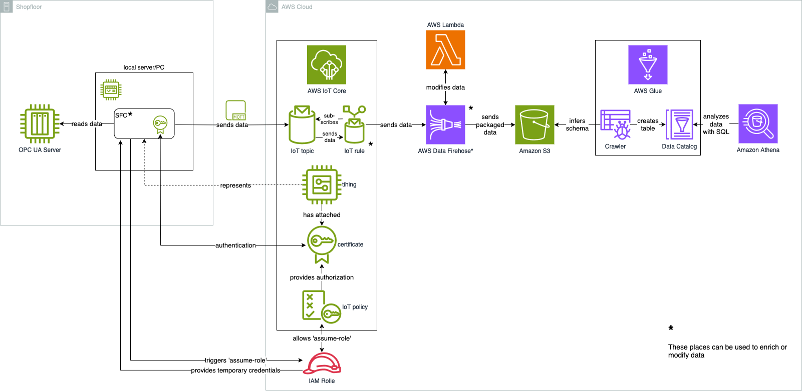

*This is sample code, for non-production usage. 
You should work with your security and legal teams to meet your organizational security, regulatory and compliance requirements before deployment.*

## Content

A demo setup sending data from a public OPC UA server to AWS Data Firehose and Amazon Athena leveraging 
[Shopfloor Connectivity (SFC)](https://github.com/aws-samples/shopfloor-connectivity).

In the following sample, we will read and archive machine data via OPC UA. We will respond to changes in a tag that serves as a trigger for data collection. In a real situation, this could be a tag that signals the end of a manufacturing step. When the tag changes, the values of additional tags are read and sent together as a dataset to AWS.

We will connect SFC (Shopfloor Connectivity) to a public OPC UA Server and read two tags:

Data tag (NodeId "ns=3;i=1002"):  
• Provides random numbers in the range of -2 to 2  
• Is transmitted twice: once in original form and once rounded to two decimal places  
The resulting two channels are connected to the trigger tag via a condition filter and 
therefore depend on the trigger tag.  

Trigger tag (NodeId "ns=3;i=1005"):  
• Provides the values -2, -2, 2, 2 at one-second intervals ("square")  
• Data transmission only occurs when the value changes from -2 to 2  

The data is then routed to AWS IoT Core, which enables almost real-time server-side [filtering, transformation](https://docs.aws.amazon.com/de_de/iot/latest/developerguide/iot-sql-functions.html), and routing to different destinations with rules, as in this example, or via pub/sub through MQTT.

From AWS IoT Core, we send data to Amazon Data Firehose, which allows server-side data transformation before storage with built-in retry mechanisms, buffering, and optional compression to optimize storage consumption.

Note that SFC itself can also batch and transform data as well as send data to different targets. It depends on your requirements which option you prefer. This architecture is meant as a starting point rather than a one-size-fits-all solution.



## Tutorial
1. Preparation 
    1. Clone the repository and navigate to the project folder in the terminal
    ```bash
    git clone https://github.com/aws-samples/sfc-ingestion-pipeline
    ```
    2. Download the required SFC binaries (OPC UA Adapter, SFC Core, Debug Target, and AWS IoT Core Target):
    ```bash
    git_top_level="$(git rev-parse --show-toplevel)"
    cd ${git_top_level}/sfc-binaries
    wget https://github.com/aws-samples/shopfloor-connectivity/releases/download/v1.7.3/{debug-target,aws-iot-core-target,opcua,sfc-main}.tar.gz
    for file in *.tar.gz; do
      tar -xf "$file"
      rm "$file"
    done
    cd -
    ```

2. Create CloudFormation Stack (using AWS Console)
    1. Sign in to your AWS account and open the CloudFormation console: https://console.aws.amazon.com/cloudformation/home?region=eu-central-1.  
    Make sure you're in the 'eu-central-1' (Frankfurt) region for this configuration.
    2. Click on "Create stack".
    3. Choose "Upload a template" and upload the CloudFormation template 'cloudformation/sfc-ingestion-demo-resources.yaml' and follow the menu.
    4. In the next step, enter a name for the stack. Leave all other settings unchanged and follow the menu.
    5. Confirm the checkbox "I acknowledge that AWS CloudFormation might create IAM resources."
    6. Click the "Submit" button at the end of the process to start the stack deployment.

3. SFC Configuration
    1. In the CloudFormation Console, switch to the "Outputs" tab of your stack. The outputs will be visible once the stack has been created and is in 'CREATE_COMPLETE' status.
    2. Open the link in the value of the "CertificatesAndKeysBucket" key and the link in the value of the "S3DataBucketLink" key. The first link points to an S3 bucket containing the certificate and private key for authentication. The second link points to the S3 bucket that will later contain the data.
    3. Download the certificate and private key from the S3 bucket and save both files in the project's 'auth' folder.
    4. Download the Amazon Root CA from the public URL and save it as a file in the 'auth' folder as well.
    ```bash
    wget https://www.amazontrust.com/repository/AmazonRootCA1.pem -O ${git_top_level}/sfc-artefacts/auth/root-CA.pem
    ```
    5. Determine the IoT Credentials Provider endpoint using the following AWS CLI command and enter it instead of the placeholder     <MY_IOT_CREDENTIALS_ENDPOINT> in the file 'sfc-artefacts/sfc-config.json':
    ```bash
    aws iot describe-endpoint --endpoint-type iot:CredentialProvider --output text
    ```
    Save the file after making the change.

4. Start and validate SFC
    1. Start SFC with the command
    ```bash
    cd $git_top_level
    sfc-binaries/sfc-main/bin/sfc-main -config sfc-artefacts/sfc-config.json
    ```
    2. Open the AWS IoT Core Console, navigate to the MQTT Test Client, and subscribe to the topic 'opcua/device/my_opcua_gateway_1' to observe the     incoming data in the Test Client.
    3. The data is now forwarded from the IoT Core Rule to Firehose and stored in the S3 bucket, where the first data should be visible shortly.
    
5. Data Analysis with AWS Glue and Athena
    1. Open the AWS Glue Console and start the crawler to read the data schema and create a table.
    2. Wait until the crawler has created the table in the Data Catalog.
    3. Open the Amazon Athena Console. 
    **If you've never used Amazon Athena you might be prompted with a banner asking you to specify an S3 bucket as the location for query output in the same region. Create a bucket if needed.**
    4. Select the new database, enter a SQL query like below, and execute the query to see the result.
    ```SQL
    SELECT * FROM "sfc-ingestion-demo-db"."<INSERT_YOUR_TABLE_NAME>" limit 10;
    ```

6. Cleanup  
The stack is build to cleanup all the provisioned resources when deleted.  
Mind the bucket you might have created for Amazon Athena query output, you need to delete 
it manually if you dont want to keep it for further usage of Amazon Athena.
